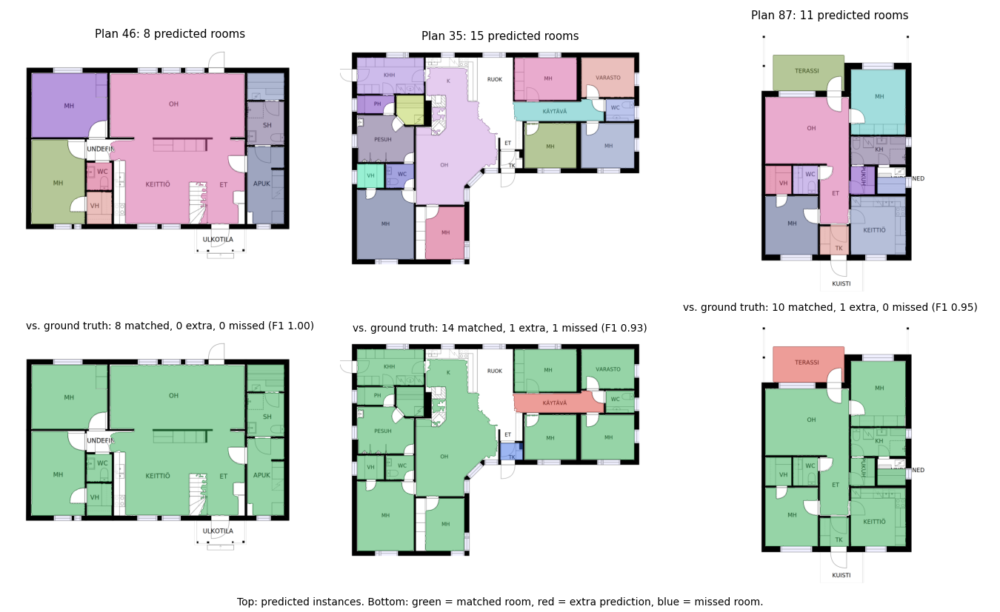

# Multi-object Few-shot SAM for Floor Plans

Reference implementation for the paper
**"Few-shot learning with large foundation models for automated segmentation
and accessibility analysis in architectural floor plans."**

This repository segments **every room** in a floor plan from a handful of example
plans in which **one** room is marked. Nothing is trained: the Segment Anything
Model (SAM) proposes candidate regions, and DINOv2 features of the marked rooms
decide which candidates are rooms.



## Status

This repository provides the data
preprocessing pipeline and a improved version of implemention compared to the one in the paper: a training-free few-shot room
segmentation pipeline with example data and a tutorial notebook. Specifically, we improved the feature extraction and the overall workflow. 

Roadmap:

- [x] Data preprocessing
- [x] Proof of concept
- [ ] Full implementation

## Installation

```bash
# 1. Install PyTorch for your CUDA version: https://pytorch.org/get-started/locally/

# 2. Install the remaining dependencies
pip install -r requirements.txt

# 3. Download the SAM ViT-H checkpoint (2.6 GB)
mkdir -p checkpoints
wget -P checkpoints https://dl.fbaipublicfiles.com/segment_anything/sam_vit_h_4b8939.pth
```

The DINOv2 weights (`facebook/dinov2-base`) are downloaded from Hugging Face on
first use. A CUDA GPU is strongly recommended; the pipeline peaks at about 8 GB
of GPU memory and takes about 2 s per floor plan on an RTX 4090.

Tested with Python 3.11, PyTorch 2.5.1 (CUDA 12.4), transformers 4.47.1 and
scikit-learn 1.5.2.

## Quick start

### Notebook

[`getting_started.ipynb`](getting_started.ipynb) walks through the whole
pipeline on the example data: building the segmenter, looking inside one
prediction, evaluating against ground truth, changing settings and preparing
your own data.

### Command line

```bash
python segment_floorplans.py \
  --ref-images examples/references/images \
  --ref-masks examples/references/masks \
  --images examples/test/images \
  --output-dir outputs/examples \
  --save-vis

python evaluate.py --pred-dir outputs/examples --gt-dir examples/test/gt
```

`segment_floorplans.py` writes `masks_<name>.npy` (a `(num_rooms, H, W)` boolean
array per plan), optional `overlay_<name>.jpg` previews and `config.json`.
On the six example plans, `evaluate.py` reports 58 of 59 rooms matched with
3 extra predictions (precision 0.951, recall 0.983, F1 0.967).

Every setting of the pipeline is also a flag, for example `--min-similarity 0.5`
or `--no-merge-gap`; run `python segment_floorplans.py --help` for the list.

### Python

```python
from fewshot_sam import FewShotRoomSegmenter, SegmenterConfig, load_image, load_references

references = load_references('examples/references/images', 'examples/references/masks')
segmenter = FewShotRoomSegmenter(SegmenterConfig(sam_checkpoint='checkpoints/sam_vit_h_4b8939.pth'))
segmenter.set_references([(image, mask) for _, image, mask in references])

masks = segmenter.segment(load_image('examples/test/images/46.jpg'))  # (num_rooms, H, W) bool
```

## How it works

1. **Prototypes.** DINOv2 features inside the marked reference rooms are
   clustered into three prototypes. For a new plan, a similarity map records how
   much each location resembles them.
2. **Proposals.** A 32 x 32 grid of points prompts SAM on a single image
   embedding. Each point returns three candidate masks; after discarding
   low-confidence ones, about 2,000 to 2,500 candidates remain per plan.
3. **Checks.** A candidate is kept when it is similar to the references, has a
   mostly blank interior, has an outline on drawn lines (small masks only), is
   proposed repeatedly by different points, and has a plausible size.
4. **Selection.** Candidates are visited from most to least convincing.
   Overlapping masks and masks inside an already kept room are dropped, thin
   fragments along a kept room are merged into it, and a large mask that
   contains several complete rooms is split into them.
5. **Merge and refinement.** Kept masks that touch along a long stretch without
   a drawn wall are merged, which joins open-plan areas. Each mask is then
   hole-filled and refined with a box prompt.

All settings and their defaults are documented in
[`fewshot_sam/segmenter.py`](fewshot_sam/segmenter.py).

## Example data

`examples/` holds five reference plans and six test plans from CubiCasa5K. The
test plans were chosen because the pipeline segments them well, so they show it
at its best.

```
examples/
├── references/
│   ├── images/00.jpg … 04.jpg   reference floor plans
│   └── masks/00.png … 04.png    one marked room per plan (non-zero = room)
└── test/
    ├── images/*.jpg             floor plans to segment
    └── gt/*.png                 ground-truth rooms as a label map (0 = no room, k = room k)
```

The reference masks can be rough: here each is a rectangle drawn inside one
bedroom. A room is a region enclosed by walls or doors, so open-plan areas
joined through a doorless gap count as one room, and balconies and terraces are
not rooms.

To use your own plans, put one mask per reference plan next to it with the same
file stem, and point `--ref-images`, `--ref-masks` and `--images` at your
folders. Ground truth for `evaluate.py` can be a label-map PNG or the
`(num_rooms, H, W)` `.npy` files written by `extract_cubicasa_data.py`.

## Data Preprocessing

`extract_cubicasa_data.py` renders CubiCasa floor plans, extracts per-room
masks, and saves a single selected room mask for each sample. The selected
masks can serve as reference masks for the segmentation pipeline.

### 1. Download the dataset

Download the CubiCasa5K floor plans from
[Zenodo](https://zenodo.org/record/2613548), unzip the archive, and place
the contents under the `data/` directory:

```
data/
└── cubicasa5k/
    ├── train.txt
    ├── val.txt
    ├── test.txt
    └── ...
```

### 2. Run the extractor

```bash
python extract_cubicasa_data.py \
  --txt test.txt \
  --svg-dir svg_images_new \
  --npy-dir mask_npys_new \
  --selected-mask-dir train_masks_new
```

The preprocessing script reuses the `floortrans` package that ships with
[CubiCasa5K](https://github.com/CubiCasa/CubiCasa5k), which is already
included in this repository.

### 3. Outputs

| Flag                   | Contents                                                          |
| ---------------------- | ----------------------------------------------------------------- |
| `--svg-dir`            | Rendered `model.svg` floor plans saved as `.jpg`                  |
| `--npy-dir`            | All room masks per sample as `.npy` with shape `(num_rooms, H, W)`|
| `--selected-mask-dir`  | One selected room mask per sample saved as `.png`                 |

### Useful options

| Flag                | Default              | Description                                       |
| ------------------- | -------------------- | ------------------------------------------------- |
| `--data-path`       | `data/cubicasa5k/`   | Root directory of the CubiCasa5K dataset          |
| `--txt`             | `test.txt`           | Split file under `--data-path`                    |
| `--start-index`     | `0`                  | First dataset index to process                    |
| `--max-samples`     | `None`               | Process at most this many samples                 |
| `--selected-rank`   | `2`                  | Save the Nth largest room as the selected mask    |
| `--original-size`   | off                  | Use original-size labels instead of scaled labels |
| `--overwrite`       | off                  | Overwrite existing files in the output directories|

## Repository structure

```
├── fewshot_sam/                  few-shot segmentation package
│   ├── segmenter.py              SegmenterConfig and FewShotRoomSegmenter
│   ├── metrics.py                instance matching, precision / recall / F1
│   ├── data.py                   loading images, masks and label maps
│   └── viz.py                    mask and evaluation overlays
├── segment_floorplans.py         segment a folder of floor plans
├── evaluate.py                   score predictions against ground truth
├── getting_started.ipynb         tutorial notebook
├── examples/                     reference and test floor plans
├── assets/                       figures for this README
├── extract_cubicasa_data.py      CubiCasa5K preprocessing
├── floortrans/                   CubiCasa5K loaders used by the preprocessing
└── requirements.txt
```

## Citation

If you use this code, please cite:

```bibtex
@article{zhang2025few,
  title   = {Few-shot learning with large foundation models for automated segmentation and accessibility analysis in architectural floor plans},
  author  = {Zhang, Haolan and Zhang, Ruichuan},
  journal = {Journal of Infrastructure Intelligence and Resilience},
  volume  = {4},
  number  = {2},
  pages   = {100137},
  year    = {2025},
  publisher = {Elsevier}
}
```

## Acknowledgements

* [Segment Anything](https://github.com/facebookresearch/segment-anything) and
  [DINOv2](https://github.com/facebookresearch/dinov2), both released under the
  Apache License 2.0.
* [CubiCasa5K](https://github.com/CubiCasa/CubiCasa5k), licensed under the
  Creative Commons Attribution-NonCommercial 4.0 International License. The
  floor plans in `examples/` and the `floortrans` package come from CubiCasa5K.
